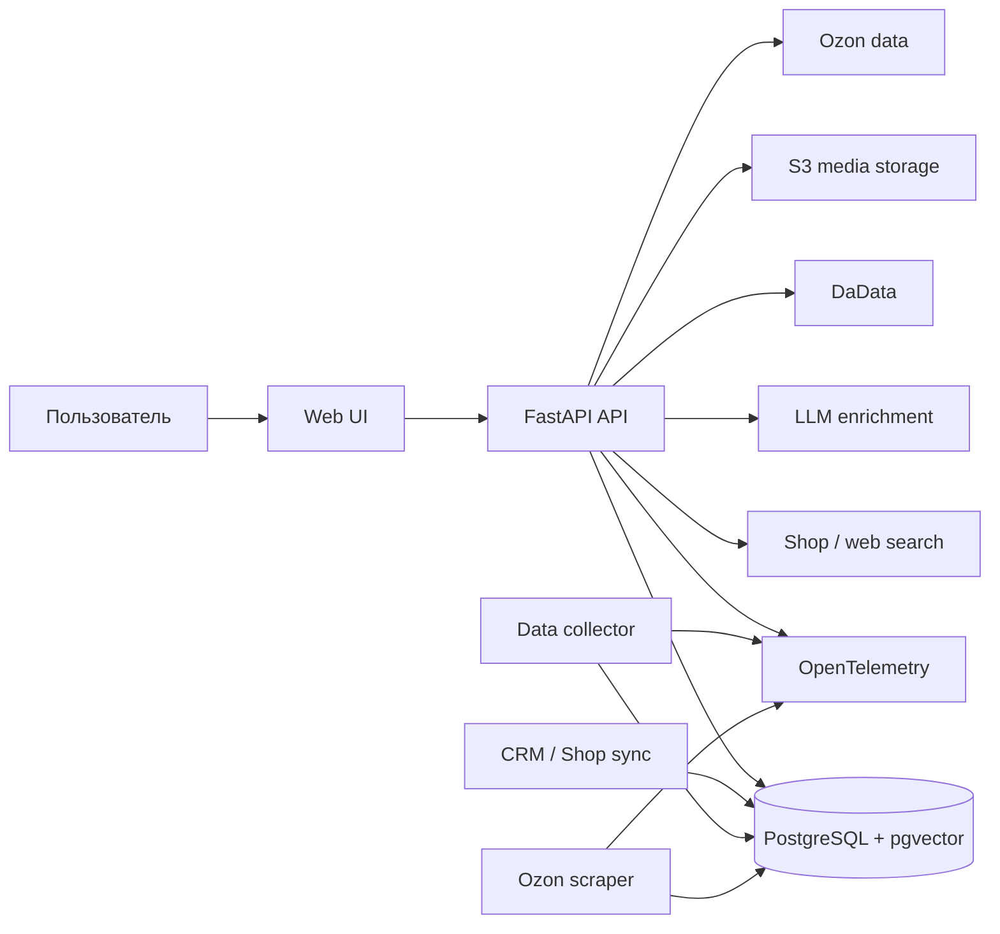

# Assistant

Внутренний сервис для работы с каталогом товаров и связанными коммерческими данными.

Система помогает:

- находить товары в локальной базе и во внешних источниках;
- искать поставщиков и дополнительную информацию о товарах;
- создавать и обогащать карточки товаров;
- находить похожие и альтернативные товары;
- собирать данные о компаниях и индивидуальных предпринимателях;
- автоматически обрабатывать товарные данные из файлов;
- получать информацию о брендах, продавцах и товарах на Ozon;
- синхронизировать данные из CRM и интернет-магазина.

Проект объединяет API, серверный веб-интерфейс, фоновые workers, data pipeline и инфраструктуру для поиска, эмбеддингов, LLM-интеграций и наблюдаемости.

## Для чего нужен проект

Каталог товаров содержит данные из нескольких источников, которые нужно сопоставлять, дополнять и поддерживать в актуальном состоянии. Одних CRUD-операций для этого недостаточно: требуется поиск по смыслу, обработка неструктурированных данных, внешние интеграции, фоновые задачи и контроль результатов.

Проект решает эту задачу как единая платформа:



## Основные пользовательские сценарии

### Список сервисов


### Поиск и создание товара

Пользователь ищет товар по коду или описанию. Система может обратиться к Shop API, локальной базе и веб-поиску. При создании нового товара enrichment-методы дополняют данные, после чего для поиска создаются текстовые эмбеддинги.


### Поиск альтернатив

Для товара можно найти похожие позиции. Ранжирование учитывает несколько сигналов:

- dense-эмбеддинги;
- ColBERT-эмбеддинги;
- сходство характеристик и опций;
- принадлежность к категориям.

https://github.com/user-attachments/assets/88bc2ff2-991b-48b2-ab22-02e94e29305d

### Работа с организациями

По ИНН или ОГРН система получает регистрационные данные из DaData, сохраняет их в PostgreSQL и запускает дополнительный LLM-enrichment. Результат включает профиль компании, релевантные виды деятельности, возможные категории товаров и бренды.

https://github.com/user-attachments/assets/1e37fd50-e647-4ffb-8935-90d9d9b8c167

### Сбор товарных данных

Пользователь загружает файл и выбирает поля, которые нужно собрать. Система создаёт задачу, разбивает её на сущности, распределяет обработку между worker-ами и сохраняет статус, trace ID и ошибки каждой сущности. Готовый результат можно скачать через API или UI.


### Ozon

Для бренда создаётся задача скрейпинга. Отдельный worker получает товары из очереди, управляет Chromium через CDP, сохраняет результаты и связывает их с внутренним каталогом.

https://github.com/user-attachments/assets/285351e9-9410-4325-aab2-e35a45c808e3

### Синхронизация

Отдельный runner последовательно выполняет:

1. синхронизацию данных из CRM;
2. синхронизацию данных из магазина компании;
3. генерацию или обновление эмбеддингов товаров.

Этот процесс запускается вручную или по расписанию через Ofelia.

## Архитектура

Репозиторий организован по `Polylith`.

```text
assistant-api/
├── bases/        Запускаемые приложения и workers
├── components/   Переиспользуемые доменные и инфраструктурные компоненты
├── projects/     Poetry-проекты и Docker-контексты
├── development/  Скрипты ручного запуска и диагностики
├── test/         Тесты bases и components
├── models/       Локально загружаемые ONNX-модели
└── docker-compose*.yaml
```

### Bases

| Base | Роль в системе |
| --- | --- |
| `entrypoint` | Основной FastAPI API и публичные доменные endpoint-ы |
| `user_interface` | SSR-интерфейс для работы с каталогом, задачами и Ozon |
| `migrator` | Применение Alembic-миграций |
| `data_sync_runner` | Синхронизация CRM, Shop и эмбеддингов |
| `data_collector` | Фоновая обработка задач сбора данных |
| `ozon_scraper` | Фоновая обработка товаров Ozon через Chromium |

### Components

| Component | Ответственность |
| --- | --- |
| `database` | SQLAlchemy-модели, DAO, PostgreSQL, pgvector и LMDB |
| `product` | Товары, эмбеддинги и поиск альтернатив |
| `shop` | Клиент внешнего Shop API |
| `enrichment` | LLM-агент, веб-поиск, DaData, описания и характеристики |
| `text_encoder` | BGE-M3 и RuBERT через ONNX Runtime |
| `data_sync` | CRM/Shop sync и генерация эмбеддингов |
| `data_collect` | Модели, методы и процессоры задач сбора |
| `ozon` | Ozon DTO и доменная логика скрейпинга |
| `media_storage` | S3-совместимое хранилище и media URL |
| `rpc` | RabbitMQ RPC-инфраструктура |
| `domain_core` | Общие доменные абстракции и исключения |
| `logging` | Структурированные логи и общие настройки трассировки |

### Инфраструктурные проекты

В `projects/` находятся Docker-контексты для:

- PostgreSQL и pgvector;
- Chromium;
- SSH-туннеля к Shop PostgreSQL;
- OpenRouter proxy;
- SeaweedFS и Jina Reader;
- Jaeger и Quickwit;
- Wren Engine, Wren AI Service, Wren UI и Qdrant.

## Инженерные решения

### Polylith-монорепозиторий

Переиспользуемая логика отделена от запускаемых приложений. Один компонент может использоваться API, worker-ом и runner-ом без копирования доменного кода.

### Dependency Injection

Сборка приложений и зависимостей выполняется через Dishka. Провайдеры компонентов изолируют настройки, подключения к базам данных, DAO и доменные методы от entrypoint-ов.

### Асинхронная обработка

FastAPI, SQLAlchemy, HTTP-клиенты и фоновые workers используют async API. Долгие операции вынесены из пользовательского запроса в отдельные задачи или workers.

### Семантический поиск

Для поиска используются PostgreSQL/pgvector, LMDB и ONNX-энкодеры. BGE-M3 применяется для dense- и ColBERT-представлений, RuBERT — для русскоязычных embedding-задач.

### LLM как часть бизнес-процесса

LLM используются не как отдельный чат, а внутри прикладных сценариев:

- поиск и обогащение данных о поставщиках;
- сбор описаний товаров, брендов и категорий;
- нормализация характеристик;
- enrichment-профиля организации;
- агентный поиск с инструментами веб-доступа.

Промпты хранятся в компонентах enrichment и версионируются вместе с кодом.

### Наблюдаемость

Сервисы используют структурированные логи `structlog` и OpenTelemetry. Трассируются HTTP-запросы, SQL-операции, LLM-интеграции, фоновые workers и отдельные сущности data collection.

## Технологический стек

| Область | Технологии |
| --- | --- |
| Backend | Python 3.12, FastAPI, Uvicorn, Pydantic |
| Архитектура | Polylith, Dishka, async/await |
| Данные | PostgreSQL 17, SQLAlchemy 2, asyncpg, Alembic |
| Поиск | pgvector, pg_trgm, LMDB, BGE-M3, RuBERT |
| LLM и enrichment | OpenRouter, Jinja2 prompts, DaData, Serper, Yandex Search, Jina Reader |
| Web UI | Jinja2, HTMX, Alpine.js, Tailwind CSS |
| Ozon | nodriver, Chromium, CDP |
| Хранилище | S3-compatible API, SeaweedFS |
| Messaging | RabbitMQ, `aio-pika` |
| Observability | OpenTelemetry, Jaeger, Quickwit, structlog |
| Delivery | Docker Compose, GitHub Actions, Poetry |

## API и UI

Основной API доступен под префиксом `/api/v1`. Для защищённых endpoint-ов используется заголовок:

```http
Authorization: SECRET <API_SECRET_KEY>
```

Основные группы API:

- `/search` — поиск в Shop, CRM и веб-источниках;
- `/products` — товары, поставщики, альтернативы и категории;
- `/party` — регистрационные данные и enrichment организаций;
- `/collect/tasks` — задачи сбора и результаты;
- `/brands` — бренды и связанные товары;
- `/ozon` — задачи скрейпинга и статистика;
- `/openrouter` — баланс LLM-провайдера.

Документация API генерируется FastAPI:

```text
/api/docs
/api/redoc
/api/openapi.json
```

UI предоставляет сценарии поиска, просмотра товаров, работы с компаниями, задачами сбора, брендами и Ozon. Интерфейс использует JWT cookie и отдельные токены для внутренних сервисов и elevated-доступа.

## Данные и внешние сервисы

### PostgreSQL

Основное хранилище бизнес-данных: товары, категории, поставщики, бренды, организации, задачи сбора и Ozon-сущности. Для векторного поиска используется pgvector.

### LMDB

ColBERT-эмбеддинги хранятся в `colbert_embeddings.db`. Файл локальный и игнорируется Git.

### ONNX-модели

При старте text encoder загружает модели через Hugging Face Hub в каталог `models`:

- `ycalk/bge-m3`;
- `ycalk/rubert-tiny2`.

Каталог моделей также игнорируется Git.

### Внешние зависимости

В зависимости от сценария проект взаимодействует с:

- CRM PostgreSQL;
- Shop API и Shop PostgreSQL через SSH-туннель;
- OpenRouter и OpenRouter proxy;
- DaData, Serper, Yandex Image Search и Jina Reader;
- Ozon через Chromium/CDP;
- S3-compatible storage;
- RabbitMQ;
- Jaeger, Quickwit, Wren и Qdrant.

## CI/CD

Pipeline:

1. Устанавливает Python 3.12, Poetry и Polylith-плагины.
2. Собирает wheels для API, UI, migrator и трех workers.
3. Экспортирует зависимости каждого проекта.
4. Создаёт `deploy.zip` с Docker Compose и проектами.
5. Формирует `.env` из GitHub Secrets и Variables.
6. Передаёт артефакты на сервер по SCP.
7. Пересобирает и запускает Docker Compose по SSH.
